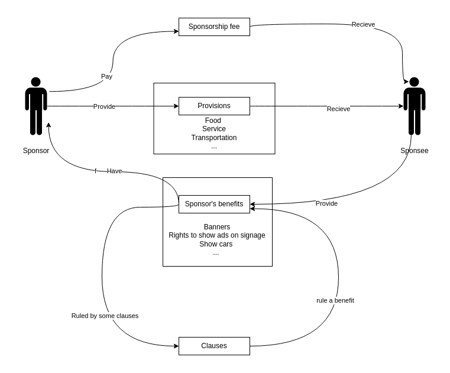

# Sponsorship agreement ontology 

## 2 dimensions 

###  Contract's structure 
- Contract 
    - agreement date 
    - effective date
    - expiration date  
    - governing law 
    - ...
- Clause 
    - obligation 
    - right 
    - conditional clause 
    - unconditional clause 

## Semantic Aspect 

- Parties 
    - sponsor 
    - sponsee 
- Asset 
    - sponsor's benefit 
    - spsonors' provision 
    - sponsorship fee 
        - a list of installment

- Clause 
    - sponsor's obligation 
    - sponsor's right 
    - sponsee's obligtaion 
    - sponsee's right 

